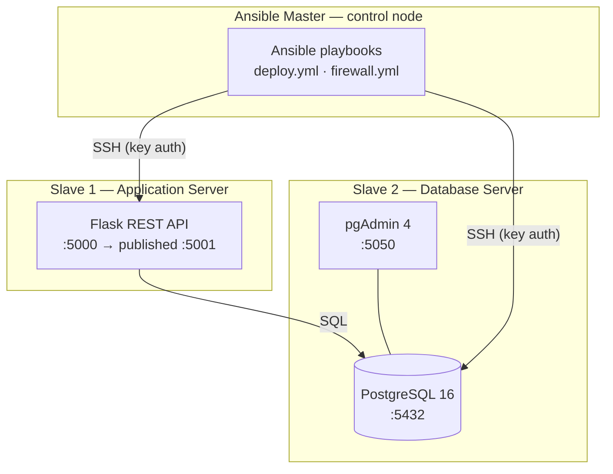

# Docker + Ansible Mini Project

A small DevOps setup that runs three containers acting as servers:

- **Ansible Master** - control node that automates the deployment
- **Slave 1** - Application Server (Flask REST API)
- **Slave 2** - Database Server (PostgreSQL + pgAdmin)

The master connects to the slaves over SSH, pulls the project from GitHub, and
starts the application and database with Docker Compose. Each slave runs its own
Docker daemon (Docker-in-Docker), so the app and the database really run on
separate "servers".

## Architecture

A high-level view of the three "servers" and how they talk to each other:



Each slave clones the repository and runs Docker Compose for its part (the app
on Slave 1, the database on Slave 2). The master drives all of this with Ansible.

## How it works

### SSH keys
The master generates a 4096-bit RSA key at build time. A shared Docker volume
(`ssh_keys`) is mounted into all three containers. On startup the master copies
its public key into the shared volume, and each slave copies it into
`/root/.ssh/authorized_keys`. The master then logs into the slaves with the key
(no passwords). This is configured in `ansible/inventory.ini` with
`ansible_ssh_private_key_file`.

### Application Server (Slave 1)
A Flask app on port 5000 (published as 5001). Database credentials come from
environment variables (`app/.env`), which the playbook generates at deploy time
so nothing is hardcoded.

Endpoints:

| Method | Route    | Description                                   |
| ------ | -------- | --------------------------------------------- |
| GET    | `/users` | Return all users as JSON                      |
| POST   | `/users` | Create a user (`username`, `email`, `password`) |
| GET    | `/`      | Frontend page to list and add users           |

The app retries the database connection on startup and creates the `users`
table if it does not exist. The Dockerfile has a healthcheck against `/users`.

### Database Server (Slave 2)
PostgreSQL 16 on port 5432 with a named volume for persistent data, plus
pgAdmin 4 on port 5050. Credentials come from `database/.env`, generated by the
playbook.

### Firewall
`firewall.yml` configures UFW on all three servers: default deny incoming,
allow outgoing, allow SSH. The app server also allows port 5001. The database
server allows 5432 only from the app server.

## Running the project

Requires Docker and Docker Compose.

```bash
# 1. Build the master and slave images
docker build -t ansible-master:latest ansible-master/
docker build -t ansible-slave:latest  ansible-slave/

# 2. Start the cluster
cd ansible
docker-compose up -d

# 3. Deploy the app and database
docker exec master ansible-playbook /etc/ansible/deploy.yml

# 4. Apply the firewall rules
docker exec master ansible-playbook /etc/ansible/firewall.yml
```

Check the slaves are reachable:

```bash
docker exec master ansible all -m ping
```

Use the app:

```bash
curl http://localhost:5001/users
curl -X POST http://localhost:5001/users \
  -H "Content-Type: application/json" \
  -d '{"username":"alice","email":"alice@example.com","password":"secret"}'
```

The frontend is at `http://localhost:5001` and pgAdmin (inside Slave 2) at port
5050.

## Notes

- `.env` files are gitignored and generated by the playbook, so no credentials
  are committed.
- Slaves run with `privileged: true` for Docker-in-Docker; the master is
  privileged so it can apply UFW rules.
